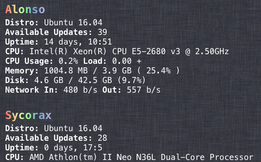

# Longviewer Widget

A widget for [Übersicht](http://tracesof.net/uebersicht/) that gets data on your servers from [Linode Longview](https://www.linode.com/longview). The work is done by the [longview-data](http://github.com/telega/longview-data) package. It uses node.js. 

## Options and Installation

Download the longviewer-widget.widget.zip file.

Unzip and drag the longviewer-widget.widget folder into your Übersicht widgets folder. Edit longviewer-widget.coffee to include the key(s) from your Linode Longview dashboard. 

## License

MIT © [Thomas Allen](http://telega.org)
